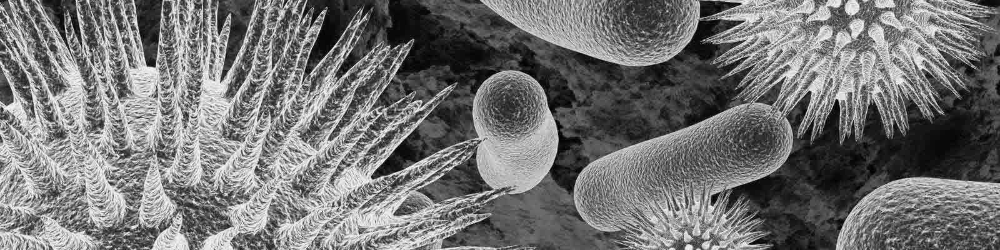

### GLOBAL HEALTH LAB : AMR

## Current Projects

##  Landscape Mapping of Antimicrobial Resistance in East and North-East India 

A Systematic Review and Meta-analysis
We are determining the burden of antibiotic-resistant infections in a North-eastern and Eastern Region of India
Find our research protocol here. [Link to PROSPERO](https://www.crd.york.ac.uk/prospero/display_record.php?ID=CRD42021278961).

## MicrobeFind

A web-based application to combat anti-microbial resistance using Computer vision to determine resistant strains of bacteria.
[Find out more](https://www.crd.york.ac.uk/prospero/display_record.php?ID=CRD42021278961)

## Our Team

#### Principal Investigator

Dr. Sangeeta Das Bhattacharya

#### PhD Scholar

Ms. Simran Malik

#### Graduate Scholar

Dr. Chetan Shirvankar

#### Graduate Scholar

Dr. Rahul Kurian Jacob

## About the Global Health Lab

Combining researchers from multiple disciplines including engineering and health sciences. The Global Health Lab works on solving problems of Public Health, Epidemiology and Vaccine Access for Children, Mothers and Families.
Please visit [Link to Projects](http://www.iitkgp.ac.in/department/MM;jsessionid=E012A22FEB1BCFE44DF38E7838EB0DD8), for more information on our ongoing projects. 

## Contact us

Global Health Lab, School of Medical Science and Technology, Indian Institute of Technology, Kharagpur, West Bengal, India
721302

